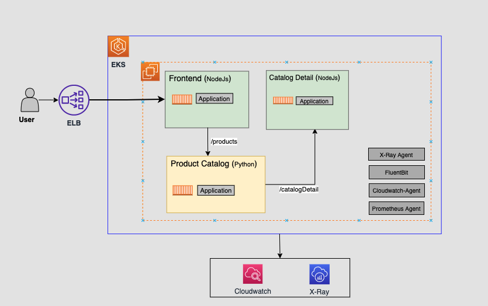
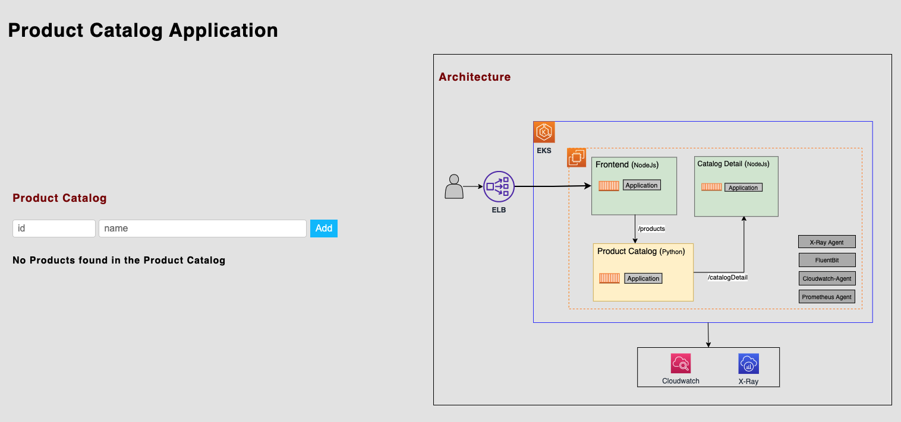
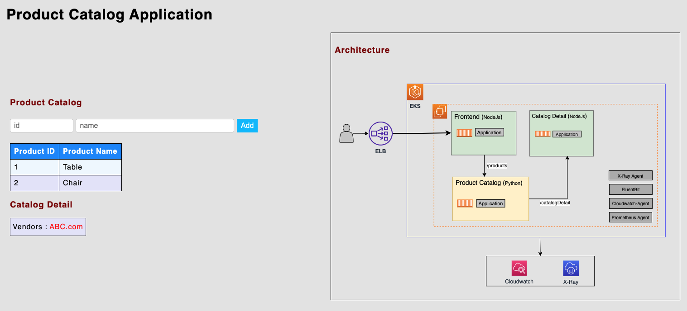

This repository is used for many AWS workshops

## Workshop on Polyglot Microservices in EKS



To Run this workshop,follow the below steps: 

### Clone the Repository
```
git clone https://github.com/aws-containers/eks-app-mesh-polyglot-demo.git
cd eks-app-mesh-polyglot-demo/workshop
```

### Install the Helm chart
```
helm install workshop helm-chart/
```
You should see below output
```
NOTES:
1. Get the application URL by running these commands:
     NOTE: It may take a few minutes for the LoadBalancer to be available.
           You can watch the status of by running 'kubectl get --namespace workshop svc -w frontend'
  export LB_NAME=$(kubectl get svc --namespace workshop frontend -o jsonpath="{.status.loadBalancer.ingress[*].hostname}")
  echo http://$LB_NAME:9000
 ```

### Get the LoadBalancer url. 
```
export LB_NAME=$(kubectl get svc frontend -n workshop -o jsonpath="{.status.loadBalancer.ingress[*].hostname}") 
echo $LB_NAME:9000
```
Go to the browser and paste this url, you should see below screen


You can add products and see the below details



## Polyglot Microservices in App Mesh and EKS plus Fargate

In this tutorial, we’ll walk you through the following, which are popular App Mesh use cases using the example of below Product Catalog Application deployment. For complete documentation checkout [Service Mesh using App Mesh](https://www.eksworkshop.com/advanced/330_servicemesh_using_appmesh/)

* Deploy a microservices-based application in Amazon EKS using AWS Fargate
* Configure an App Mesh Virtual Gateway to route traffic to the application services
* Create a Canary Deployment using App Mesh
* Enable observability features with App Mesh, including logging for Fargate, Amazon Cloudwatch Container Insights, and AWS X-Ray tracing


